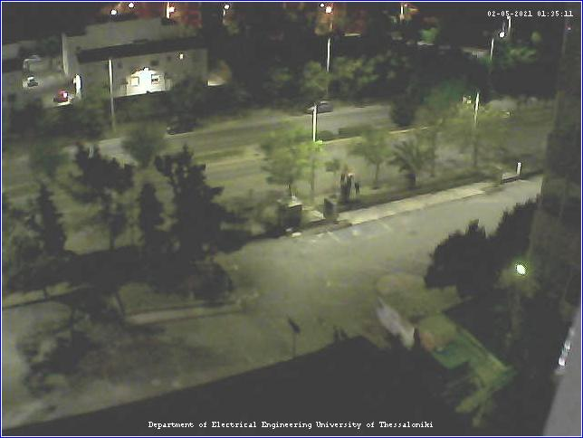
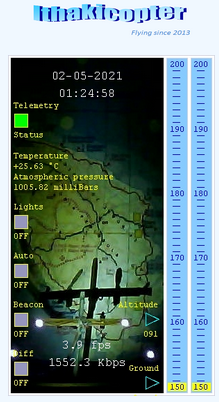

# Introduction

Sending requests to course's server "ithaki" `155.207.18.208` and collecting the corresponding data. The communication between client and server is achieved with **UDP and TCP**. The range of the applications for this channel includes **date** packets, **images**, **sound**, **control the height of an improvised copter platform** and  **vehicle diagnostics** data.

For each application, a specific request code is needed to be written in the channel. These codes are provided by the course's [website](http://ithaki.eng.auth.gr/netlab/). To automate the process, `htmlunit` framework is used for web scraping.

# Prerequisites

For the communication with the server, the client should be either connected to Internet with **VPN AUTh** or should use **port-forwarding** for ports 48000-48078.

# Usage

```shell
git clone https://github.com/thodkatz/ece-networks2.git
cd ece-networks2
make build
make run
```

# Applications

## Camera

<div align="center">
    
   <p class="image-caption">
   </p>
</div>

## Copter platform

<div align="center">
    
   <p class="image-caption"><a href="http://ithaki.eng.auth.gr/netlab/ithakicopter.html">source
      </a>
   </p>
</div>